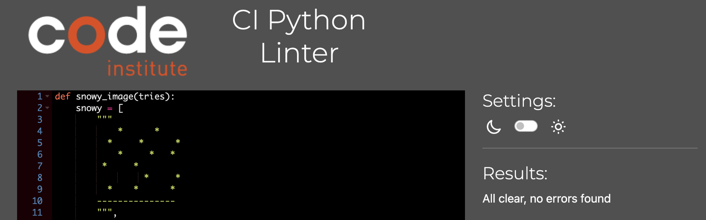
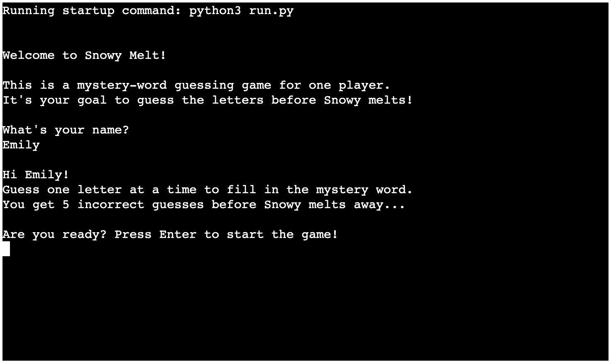
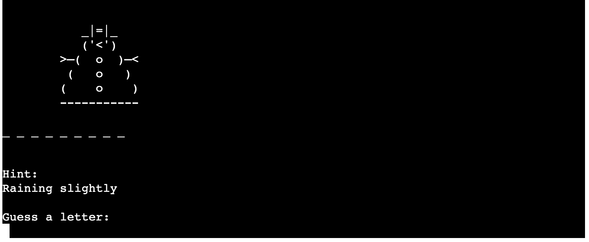
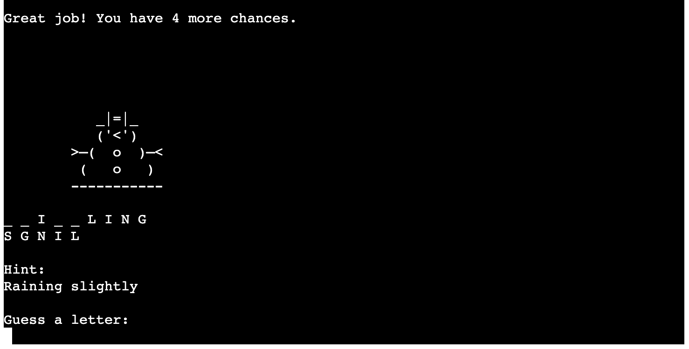
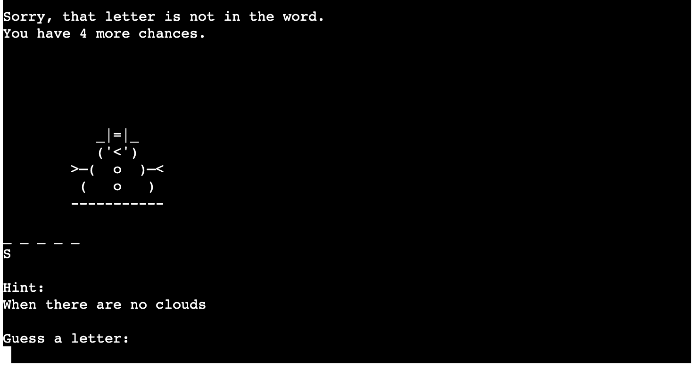

<!-- 

Welcome,

This is the Code Institute student template for deploying your third portfolio project, the Python command-line project. The last update to this file was: **March 14, 2023**

## Reminders

- Your code must be placed in the `run.py` file
- Your dependencies must be placed in the `requirements.txt` file
- Do not edit any of the other files or your code may not deploy properly

## Creating the Heroku app

When you create the app, you will need to add two buildpacks from the _Settings_ tab. The ordering is as follows:

1. `heroku/python`
2. `heroku/nodejs`

You must then create a _Config Var_ called `PORT`. Set this to `8000`

If you have credentials, such as in the Love Sandwiches project, you must create another _Config Var_ called `CREDS` and paste the JSON into the value field.

Connect your GitHub repository and deploy as normal.

## Constraints

The deployment terminal is set to 80 columns by 24 rows. That means that each line of text needs to be 80 characters or less otherwise it will be wrapped onto a second line.

---

Happy coding! -->

# ❄️ Snowy Melt

<!-- Mockup -->

Snowy Melt is a mystery-word guessing game for one player. It is written as a Python command-line game. Based on a hint and the word length, the player guesses letters to complete the word. With each wrong guess, Snowy the snowman melts away. 
The game is designed to be fun and entertaining for people of every age and ability. You can find it [here](https://snowy-melt-ad37e9d6291f.herokuapp.com/).

## Features 

<!-- In this section, you should go over the different parts of your project, and describe each in a sentence or so. You will need to explain what value each of the features provides for the user, focusing on who this website is for, what it is that they want to achieve and how your project is the best way to help them achieve these things. -->

### Current features

Greeting  
At the beginning of the game, the user inputs their name. Then they see a persoanlized greeting and an explanation of the rules. 

Start  
A random word/hint pair is pulled from the dictionary. The user sees the snowman character, underscores representing letters in the mystery word, a hint to help them guess, and a prompt to guess a letter.  

Play  
When the user guesses a letter, the input is validated and the game provides feedback. If the letter is in the word, it is added to the board. If not, the snowman melts down one level.  

End  
After the mystery word is solved or the player runs out of guesses, the game shows win or lose feedback with special graphics for each, and gives the user an option to play again.

### Design
I designed this game with a weather theme. In a small, simple game like this, a theme makes it more cohesive and fun for the user. It is meant to be entertaining for anyone, so the words are all different lengths, and some of the words and hints are easier than others. The user might not win every round, but the game is designed so that they will always discover something quirky and enjoyable!  
I used Lucidchart to design the flow of this game's functions.    
I designed this character, "Snowy," based on two different ascii images that I found online (credited below). 

### Future implementations
In the future I would like to add more features to this game. For instance:
- Feedback about how many guesses the user took to win
- A more advanced scoring system
- Levels of difficulty
- Different themes for the words and images

## Technologies used
Python  
Lucidchart  
Heroku  
Github  
Git  
Gitpod

## Testing 
This game was tested throughout development in the terminal in VS Code. It was deployed and tested using Heroku.

### Functionality
The game is written in a run.py file, and the images and word/hint pairs are stored in two other .py files. These files are imported into the main file, which gets a random wod/hint pair for each round, and iterates through the images to show the user the visual of a melting snowman. This functionality is designed to be simple and to run without errors.

### Bugs
Here are a few of the bugs I fixed during development.
- Press any key to start the game  
I researched and tried several ways to implement this, including "import keyboard" and using various functions which did not work for me. But then I found other advice arguing that using the "input()" function was probably the best solution in Python. The result is that in the finished game the user presses Enter to start the game and to play again.
- Get word/hint pairs from a dictionary  
Originally I had a list of words and a separate list of hints, but I needed them to be connected so that the pair showed in the same round of the game. My mentor helped me create a dictionary of pairs instead of two lists. Code Institute tutoring (Rebeccca) directed me toward a [resource](https://stackoverflow.com/questions/4859292/how-can-i-get-a-random-key-value-pair-from-a-dictionary/4859322#4859322) so that I could get a random pair first. Then I figured out how to get the word and the hint from there, and send them to the right place.
- The upper() function  
In order for the guessed letter to be validated, both the guess and the letters in the word must be uppercase. At first I didn't understand where this function should go. I did a lot of trial and error, and printing. After I changed the functionality of getting the word/hint pairs, I had to figure it out again.
- Re-starting the game  
I researched more about how to re-start the game using a while loop, and found [this resource](https://www.askpython.com/python/examples/restart-loop-in-python#:~:text=Restart%20a%20Nested%20Loop%20in%20Python&text=A%20nested%20loop%20is%20a,will%20understand%20this%20during%20implementation.) helpful.
- After running the code through the linter and fixing errors, I tested it again and noticed a space at the beginning of some lines of feedback. I fixed this by creating two separate print statements: one for the lines that create space in the terminal for the next guess, and one for the feedback about the correct/incorrect letter and remaining tries.

<!-- In this section, you need to convince the assessor that you have conducted enough testing to legitimately believe that the site works well. Essentially, in this part you will want to go over all of your project’s features and ensure that they all work as intended, with the project providing an easy and straightforward way for the users to achieve their goals.

In addition, you should mention in this section how your project looks and works on different browsers and screen sizes.

You should also mention in this section any interesting bugs or problems you discovered during your testing, even if you haven't addressed them yet.

If this section grows too long, you may want to split it off into a separate file and link to it from here. -->

### Code Validation 

I validated the code in the three .py files with the [Code Institute Python Linter](https://pep8ci.herokuapp.com/). The errors were blank spaces, incorrect indentation, and lines that were too long. There are now no errors.  Code in run.py:  Code in snowy_images:  Code in words_list:  

## Deployment

This app was deployed using Github and Heroku. The deployment terminal is 80 columns by 24 rows. The live link can be found [here](https://snowy-melt-ad37e9d6291f.herokuapp.com/).

## Finished game
Here are some screenshots of the finished deployed game.  
     

## Credits 
- This game was inspired by the [Hangman Game by Klara Martinsson](https://github.com/KlaraMartinsson/hangman-game/tree/main) which was provided as an example by my cohort facilitator, David Calikes. I used this example to create the structure of my project, and I'm grateful to the coder for helping me learn!
- The idea for a word-guessing game featuring a snowman came from [this website](https://rhodygirlresources.com/product/digital-sight-word-games-snowman-melt/).
- The ascii character was inspired by images [here](https://amgrubb.github.io/csc111/lab-5-loopFunc.html) and [here](https://www.momsarefrommars.com/moms-blog/category/ascii%20art).
- The words and definitions were adapted from content found in [Weather Words](https://www.metoffice.gov.uk/weather/learn-about/met-office-for-schools/other-content/other-resources/weather-words) and [EnglishClub Weather Vocabulary](https://www.englishclub.com/vocabulary/weather-vocabulary.php).
- This [resource](https://stackoverflow.com/questions/4859292/how-can-i-get-a-random-key-value-pair-from-a-dictionary/4859322#4859322) for accessing a random pair was provided by CI tutoring (Rebecca).
- I would like to thank my Code Institute mentor, Adegbenga Adeye, for walking me through new information with patient support.  
- Thanks to my cohort facilitator, David Calikes, for kind and helpful reassurance during this project, and great ideas for future implementations.